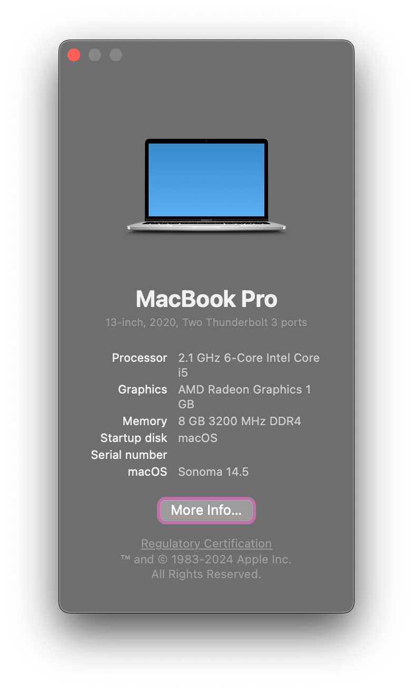

# EFI
OpenCore EFI files for my laptop, intended to be used with macOS Sonoma (should work with Sequoia however). Do not CTRL-C & CTRL+V this - it will likely not work. Uses OC version `1.0.2`.

## What works
- Wi-Fi & Bluetooth (Intel Wi-Fi 6 AX200)
- Ethernet
- All USB ports
- Speakers
- Sleep
- Keyboard
- Trackpad
- Graphics

## What doesn't
- AirDrop
- Certain Continuity features (only functional ones seem to be Universal Clipboard & Handoff)

## Kexts
Below is a list of kernel extensions that are used, along with the functionality that each one serves:

| **Kexts**                                                                                                                 | **Description**                                                                                                                                                                                               | **Included** |
|---------------------------------------------------------------------------------------------------------------------------|---------------------------------------------------------------------------------------------------------------------------------------------------------------------------------------------------------------|--------------|
| [AirportItlwm](https://github.com/OpenIntelWireless/itlwm)                                                                | An Intel Wi-Fi Adapter Kernel Extension for macOS, based on the OpenBSD Project.                                                                                                                              | Yes          |
| [AMDRyzenCPUPowerManagement](https://github.com/trulyspinach/SMCAMDProcessor)                                             | Power management, monitoring and VirtualSMC plugin for AMD processors.                                                                                                                                        | Yes          |
| [AppleALC](https://github.com/Acidanthera/AppleALC)                                                                       | Native macOS HD audio for not officially supported codecs                                                                                                                                                     | Yes          |
| [AppleMCEReporterDisabler](https://github.com/acidanthera/bugtracker/files/3703498/AppleMCEReporterDisabler.kext.zip)     | Required on macOS 12.3 and later on AMD systems, and on macOS 10.15 and later on dual-socket Intel systems.                                                                                                   | Yes          |
| [BlueToolFixup](https://github.com/acidanthera/BrcmPatchRAM)                                                              | Required to use third-party Bluetooth dongles on macOS 12 and newer.                                                                                                                                          | Yes          |
| [BrightnessKeys](https://github.com/acidanthera/BrightnessKeys)                                                           | Handler for brightness keys without DSDT patches                                                                                                                                                              | Yes          |
| [ECEnabler](https://github.com/1Revenger1/ECEnabler)                                                                      | Allows reading Embedded Controller fields over 1 byte long, vastly reducing the amount of ACPI modification needed (if any) for working battery status.                                                       | Yes          |
| [ForgedInvariant](https://github.com/ChefKissInc/ForgedInvariant)                                                         | A CPU TSC syncing kext for macOS, supports Intel & AMD.                                                                                                                                                       | No           |
| [IntelBluetoothFirmware](https://github.com/OpenIntelWireless/IntelBluetoothFirmware)                                     | Uploads Intel Wireless Bluetooth Firmware to provide native Bluetooth in macOS.                                                                                                                               | Yes          |
| [IntelBTPatcher](https://github.com/OpenIntelWireless/IntelBluetoothFirmware)                                             | Includes [workarounds](https://openintelwireless.github.io/IntelBluetoothFirmware/FAQ.html#intelbtpatcher) for bugs in `bluetoothd` on macOS 12+ and `IOBluetoothHostController` on macOS 11 and earlier.      | Yes          |
| [Lilu](https://github.com/Acidanthera/Lilu)                                                                               | Arbitrary kext and process patching on macOS                                                                                                                                                                  | Yes          |
| [NootedRed](https://github.com/ChefKissInc/NootedRed)                                                                     | The AMD Vega iGPU support patch kext. No commercial use.                                                                                                                                                      | No           |
| [NVMeFix](https://github.com/Acidanthera/NVMeFix)                                                                         | Set of patches for the Apple NVMe storage driver, IONVMeFamily. Its goal is to improve compatibility with non-Apple SSDs.                                                                                     | Yes          |
| [RealtekRTL8111](https://github.com/Mieze/RTL8111_driver_for_OS_X)                                                        | OS X open source driver for the Realtek RTL8111/8168 family                                                                                                                                                   | Yes          |
| [RestrictEvents](https://github.com/Acidanthera/RestrictEvents)                                                           | Lilu plugin for blocking unwanted processes causing compatibility issues on different hardware and unlocking the support for certain features restricted to other hardware.                                   | Yes          |
| [SMCAMDProcessor](https://github.com/trulyspinach/SMCAMDProcessor)                                                        | Power management, monitoring and VirtualSMC plugin for AMD processors.                                                                                                                                        | No           |
| [SMCBatteryManager](https://github.com/acidanthera/VirtualSMC)                                                            | VirtualSMC plugin for battery percentage reading.                                                                                                                                                             | Yes          |
| [SMCLightSensor](https://github.com/acidanthera/VirtualSMC)                                                               | VirtualSMC plugin for ambient light sensor on laptops.                                                                                                                                                        | Yes          |
| [SMCRadeonSensors](https://github.com/ChefKissInc/SMCRadeonSensors)                                                       | VirtualSMC plugin for AMD GPU temperature monitoring on macOS.                                                                                                                                                | Yes          |
| [USBMap](https://github.com/USBToolbox/tool)                                                                              | USB mapping made simpler. Generated using the "Use native classes" option, which does not depend on USBToolBox.kext.                                                                                          | Yes          |
| [VirtualSMC](https://github.com/Acidanthera/VirtualSMC)                                                                   | Advanced Apple SMC emulator in the kernel.                                                                                                                                                                    | Yes          |
| [VoodooI2C](https://github.com/VoodooI2C/VoodooI2C)                                                                       | Intel/AMD I2C controller and slave device drivers for macOS. Required for trackpad support.                                                                                                                   | Yes          |
| [VoodooI2CHID](https://github.com/VoodooI2C/VoodooI2C)                                                                    | Satellite VoodooI2C kext which implements support for I2C-HID devices.                                                                                                                                        | Yes          |
| [VoodooPS2](https://github.com/acidanthera/VoodooPS2)                                                                     | Adds keyboard support.                                                                                                                                                                                        | Yes          |

For kernel extensions not included in this repository, you should get them from the official source instead.

## Known issues
- Some apps don't work properly with < 1 GB of video memory
  - **Affected versions:** macOS 10.15+
  - **Workaround:** increase to at least 1 GB using [Smokeless-UMAF](https://github.com/DavidS95/Smokeless_UMAF).
- AirportItlwm does not work
  - **Affected versions:** macOS 15+
  - **Workarounds:**
    - Use itlwm.kext with HeliPort instead.
    - If you *really* are desperate, [patch your system using OCLP](https://github.com/OpenIntelWireless/itlwm/issues/1009), but note that OCLP is unsupported on hackintoshes. 
- iServices don't work when using AirportItlwm.kext
  - **Affected versions:** macOS 14+
  - **Workarounds:**
    - Use itlwm.kext with HeliPort instead.
    - If you *really* are desperate, [patch your system using OCLP](https://github.com/OpenIntelWireless/itlwm/issues/1009), but note that OCLP is unsupported on hackintoshes. 
    - microsocks can also be used - see [this issue](https://github.com/OpenIntelWireless/itlwm/issues/942).
- `bluetoothd` might randomly start crashing or require a full system reboot
  - **Affected versions:** exact versions unknown, confirmed to affect macOS 13.6.7+
  - **Workaround:** you can try using `sudo purge && sudo pkill -9 bluetoothd BlueTool` on a Terminal. I still do not know why this happens.
- HDMI audio, hardware encoding/decoding and hardware DRM is non-functional
  - **Affected versions:** macOS 10.15+
  - **Workaround:** N/A, see [this issue](https://github.com/ChefKissInc/NootedRed/issues/225) for HDMI audio and [this one](https://github.com/ChefKissInc/NootedRed/issues/28) for hardware DRM/VCN.
- Speakers do not work
  - **Affected versions:** macOS 15
  - **Workaround:** N/A, see [this issue](https://github.com/acidanthera/bugtracker/issues/2415).